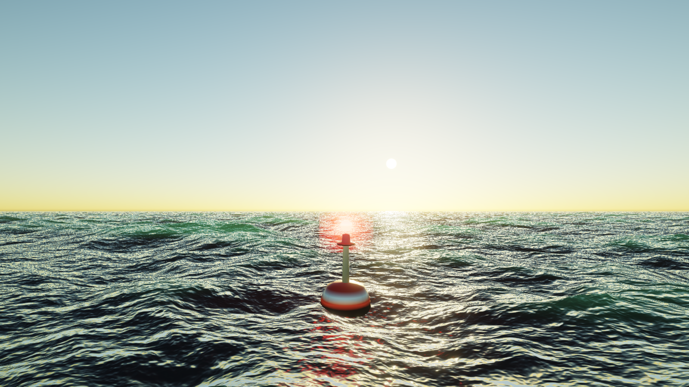
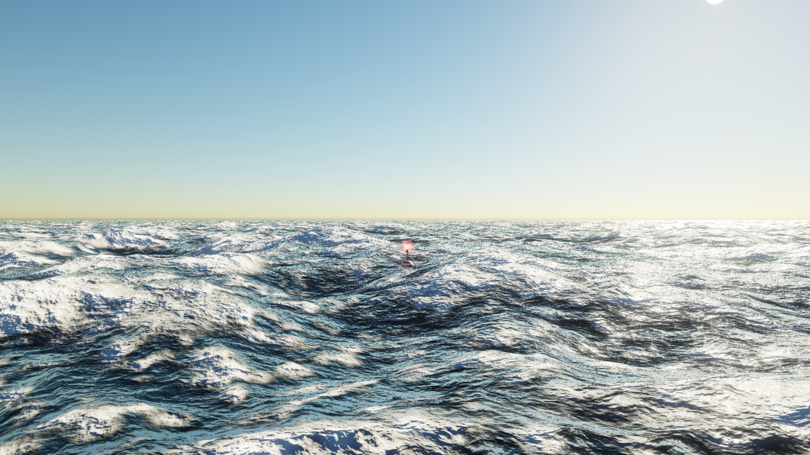
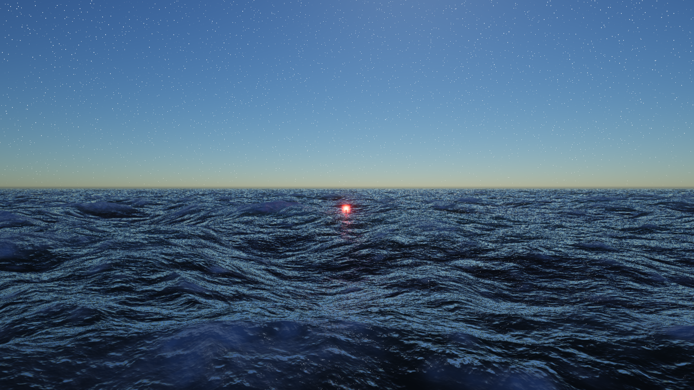
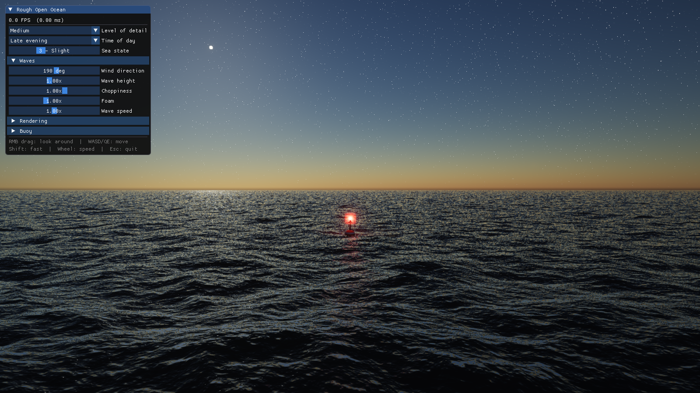
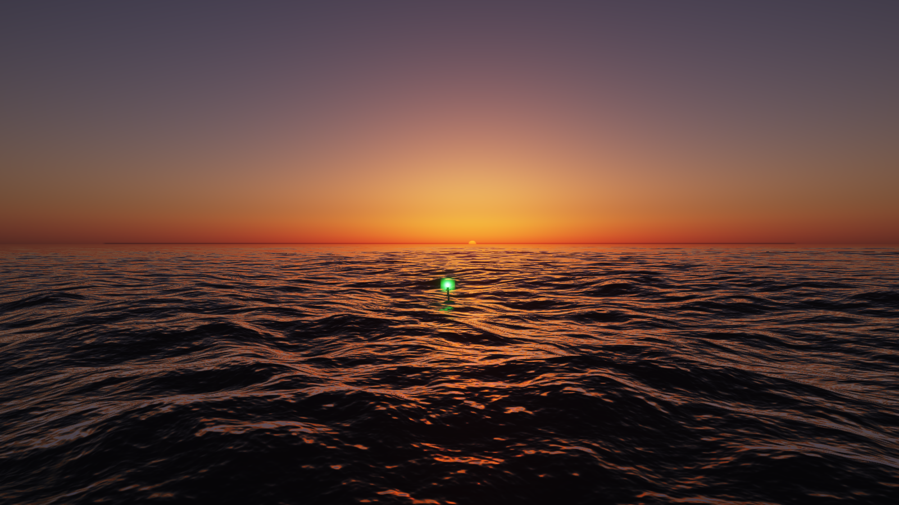
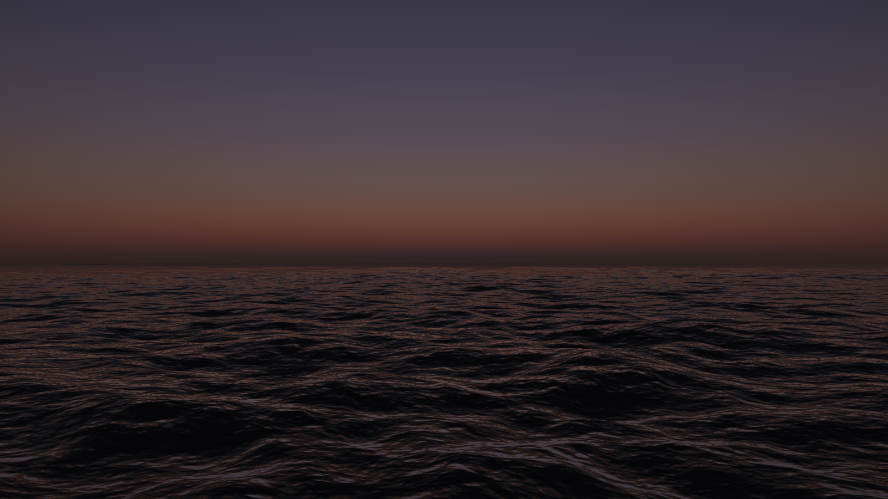
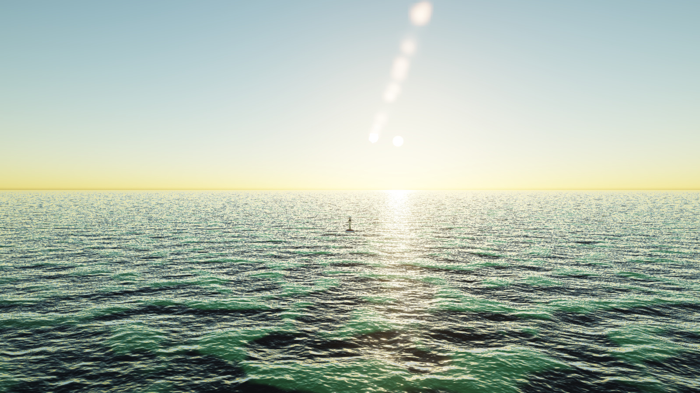
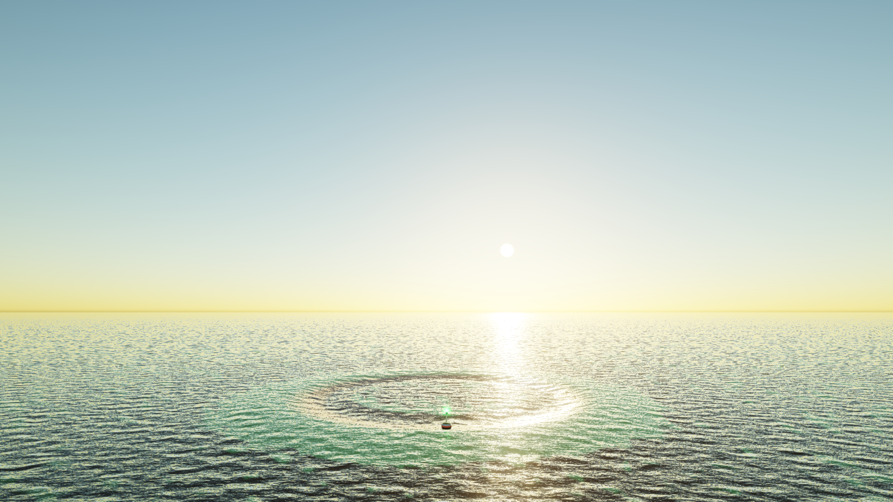

# Rough Open Ocean — DirectX 12

A real-time 3D ocean simulation written in C++ / Direct3D 12 (feature level 12_1):
an FFT-driven open ocean with adjustable sea states from glassy calm to severe storm,
a full day/night cycle with physically-inspired atmospheric lighting, and a flashing
navigation buoy that bobs on the waves.

| | |
|---|---|
|  |  |
| Evening, sea state 4 | Morning, sea state 7 |
|  |  |
| Night (moonlight), sea state 6 | Late evening + control panel |
|  |  |
| Sunset, sea state 3 | Sunset, looking away from the sun: Earth's shadow |
|  |  |
| Meteorite falling toward the water | Impact rings spreading past the buoy |

## Features and techniques

- **Ocean waves — spectral (FFT) simulation** (Tessendorf's method, the technique
  used in film and AAA games):
  - JONSWAP wind-sea spectrum with directional spreading, synthesized on the GPU
  - 3 independent FFT cascades (~487 m / 71 m / 11 m patches) to eliminate tiling
    and cover wavelengths from hundreds of meters down to centimeters
  - Radix-2 Stockham inverse FFT in compute shaders (whole scanline in groupshared
    memory, two packed complex signals per pass — 8 real fields in 4 FFTs)
  - Choppy (horizontal) displacement, analytic normals, and Jacobian-based
    whitecap foam that accumulates and decays over time
- **Ocean rendering**: camera-centered radial grid (exponential ring spacing) out to
  42 km, GGX specular sun/moon glints, Fresnel sky reflection from a filtered
  cubemap, crest subsurface scattering, procedural foam, aerial perspective fog,
  distance-based roughness (anti-aliasing of far glitter)
- **Sky**: single-scattering Rayleigh + Mie atmosphere raymarched into a cubemap
  (cached — regenerated only when the time of day changes), analytic sun disc,
  procedural moon with mare, hash-based star field, optional cirrus layer.
  The same cubemap lights the ocean and buoy (reflections + ambient)
- **Sunset**: the sun sits half below the horizon, its light crossing ~40 air
  masses of hazy maritime air. The reddening is physical, not a filter: the
  same atmosphere gains spectral aerosol haze (Angstrom exponent 1.3), a haze
  layer aloft (~4 km) and an ozone layer (Chappuis-band absorption), the sky
  adds multiple scattering (Hillaire 2020: a 32x32 LUT built in a compute
  pass), and the sun's colour is integrated through that atmosphere, so sky,
  sun, sea reflections, glints, foam and the buoy all turn red-orange
  together. Opposite the sun the sky is dusky, as it should be: the light that
  reaches that air skims the planet through the haze, so the Earth's shadow
  darkens the horizon, under a dim pink anti-twilight arch (the Belt of
  Venus) and a violet sky fed by multiply scattered light. The disc is refraction-flattened, graded
  from a yellow-orange upper limb to a red waterline by the air-mass change
  across it, and its limb "boils" in the turbulent air; cirrus is lit by the
  sunlight that reaches its altitude. On the water, glints are bounded by the
  disc they reflect (they stay orange instead of clipping to yellow), the sun
  path twinkles with footprint-matched capillary glitter, backlit crests
  transmit ember-red light through their thin tops, and the light scintillates
  by a few percent
- **Buoy**: procedural mesh; buoyancy physics (heave spring + tilt inertia + anchored
  sway) driven by GPU→CPU readback of the displacement maps; alternating red/green
  flashing lamp with an HDR glow billboard and a point light on the surrounding water
- **Meteorite strike** (left-click the water to place it exactly, or the UI
  button / `M` key for a random spot): a rock streaks in at
  2.6 km/s on a ~45° trajectory — a half-second flash across the sky with a
  lingering fire/smoke trail — then detonates on the water. The impact radiates
  two wave systems: a **fast leading bore** (a foam-capped, tsunami-like
  solitary crest with a trailing drawdown racing out at ~40 m/s, carrying the
  bulk of the impact energy) and, behind it, the slower dispersive ring packet
  of the classical **Cauchy–Poisson solution** (long waves lead, short ripples
  trail, local wavenumber k = g·t²/4r²). Both decay by cylindrical spreading
  plus temporal damping, superimpose linearly with the FFT wind sea, rock the
  buoy as they pass, and the ocean returns to its undisturbed state within a
  couple of minutes. Up to 4 impact wave systems can be live at once. The
  event is scored with three one-shot sounds — descent whoosh, impact splash,
  and the surge of the first spreading waves
- **Post-processing**: HDR (RGBA16F) → threshold bloom pyramid → ACES tonemap →
  FXAA; reversed-Z depth for horizon-scale precision
- **Sound** (XAudio2, no music), two selectable modes:
  - *Soothing* (default): a CC0 recording of calm Atlantic waves
    (`assets/ocean_loop.mp3`, decoded via Media Foundation), looped seamlessly
    with a 2 s crossfaded seam, plus a soft synthesized low roar that swells
    with the sea state
  - *Realistic*: fully procedural synthesis — deep roar, surf hiss with slow
    swell modulation, randomly scheduled stereo breaking-wave events and a
    storm wind layer (rawer and more chaotic than the recording)
  - in both modes loudness follows the sea state, and fades with wave speed
    and camera altitude
  - **meteorite event sounds**: a whoosh as the rock streaks down, a heavy
    splash on impact, and a surge of the first powerful spreading waves —
    three CC0 high-bitrate recordings (see `assets/CREDITS.txt`) played as
    one-shots over the ambient bed
- **Verification**: `--selftest` runs the GPU FFT against a CPU reference DFT;
  `--audiotest` prints synthesized sound levels per sea state

## Requirements

- Windows 10/11 with a GPU supporting Direct3D 12 feature level 12_1 or lower
  (falls back through 12_0 / 11_1 / 11_0; only shader model 5.0 features are used)
- Visual Studio 2022 with the **Desktop development with C++** workload
  (includes MSVC and CMake; no other dependencies — Dear ImGui is vendored in
  `third_party/imgui`)

## Build

From a **Developer PowerShell/Command Prompt for VS 2022** (or any shell if
`cmake` is on your PATH — Visual Studio ships one at
`...\VS\2022\<Edition>\Common7\IDE\CommonExtensions\Microsoft\CMake\CMake\bin\cmake.exe`):

```powershell
cd Rough_Ocean_DirectX
cmake -G "Visual Studio 17 2022" -A x64 -S . -B build
cmake --build build --config Release
```

Run:

```powershell
build\Release\RoughOcean.exe
```

The HLSL shaders are compiled at runtime from the `shaders` folder (copied next to
the executable by the build). You can also open `build/RoughOcean.sln` in Visual
Studio and build/run from there.

## Controls

- **Right mouse drag** — look around
- **Right mouse button + mouse wheel** — optical zoom from 0.5x to 100x: wheel
  forward zooms in, back zooms out. The level shows under the FPS readout
- **Left mouse click on the water** — drop a meteorite exactly there. Click the
  left half of the view and it streaks in from the right of the sky; click the
  right half and it comes from the left
- **W A S D / Q E** — move (Shift = fast, mouse wheel = speed)
- **1..8** — time of day presets
- **M** — launch a meteorite at a random spot ahead (same as the UI button)
- **Esc** — quit

The on-screen panel exposes: **Level of detail** (Low / Medium / High / Ultra),
**Time of day** (early morning, morning, noon, afternoon, evening, sunset,
late evening, night), **Sea state** (0 glassy … 9 severe storm), wind direction, wave height,
choppiness, foam amount, wave speed, exposure, bloom, cirrus cloud cover,
FXAA/VSync toggles, the buoy's flash timing/intensity, and the ocean sound
(mode Off / Soothing / Realistic + volume; loudness itself follows the sea
state).

## Level of detail

| LOD | FFT size | Cascades | Mesh (sectors×rings) | Sky cube | Measured on Iris Xe, 1600×900 |
|-----|----------|----------|----------------------|----------|-------------------------------|
| Low | 128² | 2 | 256×160 | 64 | ~650 FPS |
| Medium | 256² | 3 | 384×224 | 128 | ~390 FPS |
| High (default) | 256² | 3 | 512×288 | 128 | ~330 FPS |
| Ultra | 512² | 3 | 640×352 | 256 | ~170 FPS |

All levels are far above the 25–30 FPS target on an integrated Intel Iris Xe
(i7-12700H); on a discrete GPU Ultra is effectively free.

## Command line

```
--w N --h N        window size (default 1600x900)
--lod 0..3         level of detail (default 2 = High)
--sea 0..9         sea state (default 4)
--time 0..7        time of day (default 4 = evening, 5 = sunset)
--frames N         benchmark: render N frames, print average FPS, exit
--screenshot PATH  save a PNG at the end of a benchmark run
--ui               keep the UI visible in benchmark screenshots
--campos X Y Z     override the camera position (with --yaw / --pitch, degrees)
--zoom X           start at optical zoom X, 0.5..100 (default 1)
--meteor T         auto-launch a meteorite at sim time T seconds
--fixeddt S        fixed timestep in seconds (deterministic runs)
--novsync          disable vsync
--selftest         run the GPU FFT correctness test and exit
--audiotest        print synthesized ocean-sound levels and exit
```

Examples:

```powershell
# Storm at sunrise, Ultra quality
build\Release\RoughOcean.exe --time 1 --sea 8 --lod 3

# Verify the FFT compute pipeline
build\Release\RoughOcean.exe --selftest

# Benchmark + screenshot
build\Release\RoughOcean.exe --frames 300 --screenshot ocean.png
```

## Project layout

```
CMakeLists.txt
src/
  main.cpp        entry point, CLI parsing
  App.h/.cpp      frame loop, UI, presets (time of day, sea state, LOD), lighting
  Audio.*         procedural ocean sound synthesis + XAudio2 streaming
  GpuContext.*    D3D12 device/swapchain/heaps/root signatures/upload helpers
  Ocean.*         FFT cascades, compute pipeline, radial mesh, CPU readback
  Sky.*           atmosphere cubemap generation + skybox
  Buoy.*          procedural mesh, buoyancy physics, flashing lamp
  Post.*          bloom, ACES tonemap, FXAA
  Camera.h        free-look camera (reversed-Z projection)
assets/
  ocean_loop.mp3     CC0 ambient wave recording for the Soothing mode (see CREDITS.txt)
  meteor_descent.mp3 CC0 whoosh  — meteorite falling
  meteor_impact.mp3  CC0 splash  — meteorite hitting the water
  meteor_waves.mp3   CC0 wave crash — surge of the first spreading waves
shaders/
  Common.hlsli    shared frame constants + BRDF/noise helpers
  OceanSim.hlsl   spectrum init/update, Stockham FFT, displacement assembly
  Ocean.hlsl      ocean surface VS/PS
  Sky.hlsl        atmosphere raymarch CS, mip CS, skybox VS/PS
  Buoy.hlsl       buoy VS/PS + lamp glow billboard
  Post.hlsl       bloom/tonemap/FXAA passes
third_party/imgui  Dear ImGui v1.91.5 (vendored)
```

## Notes

- The sea state presets map to wind speed (0.9–25.5 m/s) and fetch via JONSWAP, so
  wave height, wavelength, choppiness and whitecap coverage all scale together
  physically; the wave sliders multiply on top of the preset.
- Changing sea state / wind / wave height re-synthesizes the initial spectrum on the
  GPU (instant); choppiness and foam react without a re-init.
- Buoy physics samples the displacement textures on the CPU with a 2-frame-latency
  readback ring, so the GPU never stalls.
- Sound runs on a dedicated thread (~100 ms blocks, three buffers in flight);
  sea-state changes glide over about a second instead of jumping. There is no
  music. The Soothing mode's recording is "Sea Waves" by DenisChardonnet /
  BigSoundBank (CC0) — see `assets/CREDITS.txt`; if the file is missing the
  app falls back to the synthesized mode.
